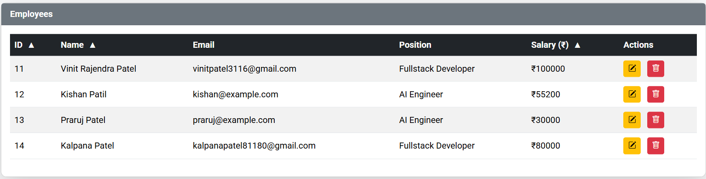
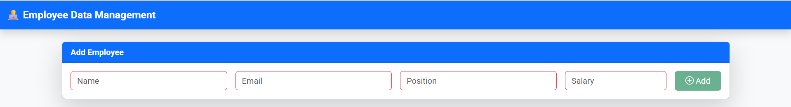
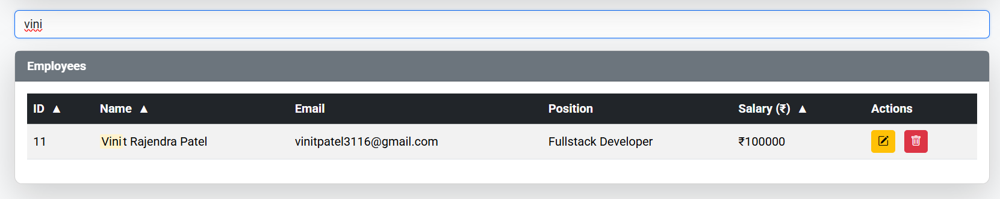
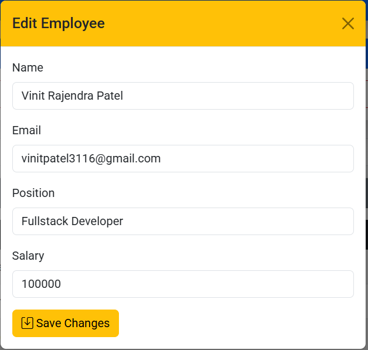

# 👨‍💻 Employee Data Management

A full-stack **Employee Data Management** built using **Node.js, Express.js, SQLite3, Bootstrap 5, and Vanilla JavaScript**.\
This project demonstrates how to build a **CRUD (Create, Read, Update, Delete)** web application with:

- 🗂 **Backend API** (RESTful with Express + SQLite3)

- 🎨 **Frontend UI** (Bootstrap 5 + Custom CSS + JavaScript)

- ✅ **Form Validation** (client-side + server-side)

- 🔍 **Search, Sort, Highlight, Toast Notifications**

- 🧪 **Automated Tests** (Jest + Supertest)

- **Live Demo Link: https://employee-data-management-jbc1.onrender.com/**

---

## 📑 Table of Contents

1.  [Project Overview](#-project-overview)

2.  [Tech Stack](#-tech-stack)

3.  [Features](#-features)

4.  [Project Structure](#-project-structure)

5.  [Setup & Installation](#-setup--installation)

6.  [Running the Project](#-running-the-project)

7.  [API Documentation](#-api-documentation)

8.  [Frontend Features](#-frontend-features)

9.  [Validation Logic](#-validation-logic)

10. [Testing](#-testing)

11. [Deployment Guide](#-deployment-guide)

12. [Future Enhancements](#-future-enhancements)

---

## 📝 Project Overview

The **Employee Data Management** project is designed to manage employees with the following capabilities:

- Add a new employee with **name, email, position, salary**

- View all employees in a **styled Bootstrap table**

- Edit employee details using a **modal form**

- Delete an employee with confirmation

- Search employees by name with **highlighted matches**

- Sort employees by **ID, Name, or Salary**

- Client-side and server-side validation to ensure **data integrity**

- Persistent storage using **SQLite3 database**

This is a beginner-friendly project, but structured in a **production-ready manner** with separation of concerns:

- `db/` for database logic

- `app.js` for backend API

- `server.js` for server + static frontend

- `public/` for frontend assets (HTML, CSS, JS)

- `tests/` for unit + integration tests

---

## 🛠 Tech Stack

- **Backend:** Node.js, Express.js

- **Database:** SQLite3

- **Frontend:** HTML5, Bootstrap 5, Vanilla JavaScript, CSS3

- **Validation:** express-validator (backend), Bootstrap validation classes (frontend)

- **Testing:** Jest, Supertest

- **Deployment Ready:** Works on local machine, can be deployed to **Render, Railway, Heroku, or Vercel (with server)**

---

## 🧠 Approach & Assumptions

**Approach:**

- Designed a RESTful backend with Express.js and SQLite3.
- Frontend built with Bootstrap 5 and Vanilla JS for simplicity and responsiveness.
- Client-side + server-side validation for data integrity.

**Assumptions:**

- Email must end with `.com` or `.in`.
- Minimum salary: 5000.

---

## ✨ Features

### 🔹 Backend (API)

- REST API endpoints for CRUD operations

- SQLite database with schema:

  `CREATE TABLE IF NOT EXISTS employees (
  id INTEGER PRIMARY KEY AUTOINCREMENT,
  name TEXT NOT NULL,
  email TEXT NOT NULL UNIQUE,
  position TEXT NOT NULL,
  salary REAL NOT NULL
);`

- Express Validator ensures correct data before DB insertion

- Error handling with proper HTTP status codes

### 🔹 Frontend (UI/UX)

- **Responsive UI** with Bootstrap 5

- **Add Employee Form** with live validation (email `.com/.in`, salary ≥ 5000)

- **Edit Employee Modal** with pre-filled data

- **Search Bar** with highlighted results

- **Sorting on columns** with arrows ▲ ▼

- **Toast notifications** for success/error feedback

- **Table row hover animations**

### 🔹 Extra

- **Clean folder structure**

- **Reusable database connection** (`db/db.js`)

- **Unit + integration tests** with database reset before each test

---

## 📂 Project Structure

```
employee-manager/
│
├── app.js                 # Express app (routes + middleware)
├── server.js              # Server entry point + static serving
├── db/
│ └── db.js                # SQLite3 connection + table creation
├── public/
│ ├── index.html           # Frontend HTML
│ └──style.css            # Custom CSS
│
├── data/
│ └── employees.db         # SQLite3 database file
├── tests/
│ └── employees.test.js    # Jest + Supertest tests
├── package.json
└── README.md              # Documentation
```

---

## ⚙️ Setup & Installation

1.  **Clone the repo**

    `git clone https://github.com/Vinit3116/employee-data-management`

    `cd employee data management`

2.  **Install dependencies**

    `npm install`

3.  **Run database setup** (automatically creates `employees.db` on first run):

    `node server.js`

4.  **Install dev dependencies (for testing)**

    `npm install --save-dev jest supertest`

---

## ▶️ Running the Project

### Development

`node server.js`

Server runs at:\
👉 <http://localhost:3000>

### Testing

`npm test`

---

## 📡 API Documentation

### **1\. Get All Employees**

`GET /api/employees`

**Response:**

`[
  { "id": 1, "name": "John Doe", "email": "john@example.com", "position": "Manager", "salary": 50000 }
]`

### **2\. Get Employee by ID**

`GET /api/employees/:id`

### **3\. Create Employee**

`POST /api/employees
Content-Type: application/json`

**Body:**

`{ "name": "Jane", "email": "jane@example.com", "position": "HR", "salary": 25000 }`

### **4\. Update Employee**

`PUT /api/employees/:id
Content-Type: application/json`

**Body:**

`{ "name": "Jane Smith", "email": "jane@example.com", "position": "HR Lead", "salary": 30000 }`

### **5\. Delete Employee**

`DELETE /api/employees/:id`

---

## 🎨 Frontend Features

- **Add Form Validation**

  - Email must end with `.com` or `.in`

  - Salary must be ≥ 5000

- **Search & Highlight**

  - Searches by name (case-insensitive)

  - Highlights matched substring in yellow

- **Sorting**

  - Click on `ID`, `Name`, or `Salary` header

  - Toggles ascending/descending order

- **Edit Modal**

  - Pre-filled form with selected employee

  - Updates via API call

- **Toast Messages**

  - Success (green), Error (red), Warning (yellow)

---

## ✅ Validation Logic

- **Frontend (Live Validation)**

  - Regex for email: `/^[^\s@]+@[^\s@]+\.(com|in)$/i`
  - Email must end with `.com` or `.in`
  - Salary ≥ 5000
  - Validates on both Add and Edit forms

- **Backend (Express Validator)**

  `body("name").notEmpty(),
body("email").isEmail(),
body("position").notEmpty(),
body("salary").isNumeric()`

This ensures **double protection**:

- Users can't bypass frontend checks

- API still enforces validation

---

## 🧪 Testing

We use **Jest + Supertest** for automated tests.

- `beforeEach` → clears DB before each test

- `afterAll` → closes DB after all tests

Example test (create employee):

```
test("POST /api/employees should create employee", async () => {
    const emp = { name:"Alice", email:"alice@example.com", position:"Manager", salary:50000 };
    const res = await request(app).post("/api/employees").send(emp);
    expect(res.statusCode).toBe(201);
    expect(res.body).toHaveProperty("id");
    expect(res.body.name).toBe("Alice");
    expect(res.body.salary).toBe(50000);
  });
```

Run tests:

`npm test`

---

## 🚀 Deployment Guide

You can deploy this on **Render, Railway, or Heroku**.\
Steps (Render example):

1.  Push code to GitHub

2.  Create a new Render Web Service → Connect repo

3.  Set build command:

    `npm install`

4.  Set start command:

    `node server.js`

5.  Deploy 🚀

---

## 📸 Screenshots

**1. Employee List Table**  


**2. Add Employee Form**  


**3. Search & Highlight Feature**  


**4. Edit Employee Modal**  


---

## 🔮 Future Enhancements

- ✅ Pagination for large datasets

- ✅ Authentication (JWT login system for admins)

- ✅ Export employees to CSV/Excel

- ✅ Switch DB from SQLite → PostgreSQL/MongoDB for scalability

- ✅ React or Vue frontend (instead of Vanilla JS)

- ✅ Role-based access control (Admin, HR, Employee)

---

## 👨‍💻 Author

**Vinit Patel**\
🔗 [LinkedIn](https://www.linkedin.com/in/vinitpatel31) | [GitHub](https://github.com/Vinit3116)
